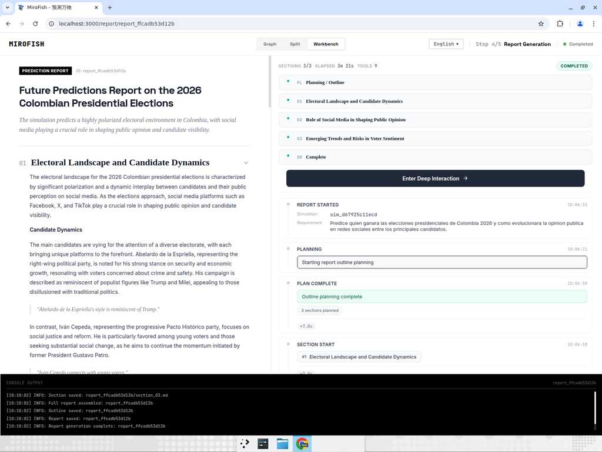

# MiroFish — Colombia 2026 Presidential Election Prediction (End-to-End Test Report)

**One-sentence summary:** Ran MiroFish's full 5-stage pipeline end-to-end on a live local instance (frontend `:3000`, backend `:5001`) with **real OpenAI + Zep keys** to generate a prediction of Colombia's 2026 presidential election and how public opinion evolves on social media among the top candidates.

**Devin session:** https://app.devin.ai/sessions/00a5e05fd20e479299ca4a0564f71cb8

---

## Important caveats (read first)

- **MiroFish is NOT a polling/forecasting system.** It is a multi-agent social-simulation engine. The output is an emergent narrative produced by LLM-driven agents seeded with real context — **not a statistically validated forecast**. Do not treat the "prediction" as a probability of winning.
- **The report does NOT name a single numeric winner.** The simulation converged on a *structural* prediction (a highly polarized two-bloc race), not a "candidate X gets Y%". I report exactly what the model produced, no more.
- **Reduced scale for speed.** I used **20 rounds** (not a full 72h sim) to keep the recording manageable. This reduces depth of emergent dynamics.
- **Mixed-language output.** With the UI in English, section bodies render in English, but the Agent Interview Q&A renders in **Chinese** (the report-gen LLM's default). Content is coherent and on-topic; flagging as a known quirk, not a failure.

---

## Test assertions

| # | Stage | Result | Evidence |
|---|-------|--------|----------|
| 1 | **Ontology** (real LLM) | PASSED | `POST /api/graph/ontology/generate` 200 — 10 entity types + 6 relation types extracted from seed |
| 2 | **GraphRAG build** (Zep) | PASSED | Zep built the knowledge graph — final **38 nodes / 89 edges** |
| 3 | **Personas + config + activation** | PASSED | **23 agent personas** created (incl. real candidates Petro/Cepeda + parties), dual-platform config + 5 seed posts generated |
| 4 | **Dual-world simulation** | PASSED | **20/20 rounds** on both Info Plaza + Topic Community, **195 total events** |
| 5 | **Prediction report** | PASSED | **3/3 sections** generated, **9 tool calls** (InsightForge + Agent Interview + Panorama Search), 3m 31s; backend log shows all sections saved |

All 5 stages passed. Two non-blocking observations: (a) Agent Interview Q&A renders in Chinese, (b) report gives a structural prediction, not a single named winner.

---

## What MiroFish predicted

### Structural prediction
> *"The simulation predicts a highly polarized electoral environment in Colombia, with social media playing a crucial role in shaping public opinion and candidate visibility."*

The simulation converged on a **two-bloc, highly polarized race** between two ideological poles, with a **high number of undecided voters** indicating a volatile outcome:

- **Abelardo de la Espriella** (radical right) — strong stance on **security & economic growth**, style explicitly likened to **Trump/Milei**, appealing to voters disillusioned with traditional politics and concerned about crime.
- **Iván Cepeda** (left / Pacto Histórico) — focus on **social justice & reform**, **favored among young voters**, continuing the momentum of Gustavo Petro.

The model did **not** declare a single 1st-round winner. Its operative thesis: the winner will be **whoever best communicates on social media and connects with voter concerns** in a polarized field with many undecideds.

### How public opinion evolves on social media
- Social media (Facebook, X, TikTok) acts as the **decisive battleground** and primary mobilization channel.
- Candidates with weak social-media presence are **disadvantaged with younger voters**.
- **Emotional engagement** sways undecided voters more than policy detail.
- **Misinformation** is the key risk to sentiment; demand for fact-checking/transparency is high.
- Opinion is **volatile and fast-moving** — rapid shifts driven by viral posts.

---

## Evidence — screenshots

### Final report (all 3 sections complete)


The full generated report markdown is attached as `full_report.md`.

---

## Backend pipeline log (report generation)

```
[10:06:31] Report saved: report_ffcadb53d12b
[10:06:38] Outline planning complete: 3 sections
[10:06:42] InsightForge complete: 38 facts, 15 entities, 33 relationships
[10:07:20] Interview API returned: 5 results, success=True
[10:07:35] PanoramaSearch complete: 47 active, 67 historical
[10:07:41] Section "Electoral Landscape and Candidate Dynamics" complete (tool calls: 3)
[10:07:46] InsightForge complete: 25 facts, 11 entities, 21 relationships
[10:08:32] Interview API returned: 5 results, success=True
[10:08:45] PanoramaSearch complete: 51 active, 88 historical
[10:08:52] Section "Role of Social Media in Shaping Public Opinion" complete (tool calls: 3)
[10:09:03] InsightForge complete: 53 facts, 21 entities, 45 relationships
[10:09:42] Interview API returned: 5 results, success=True
[10:09:56] PanoramaSearch complete: 65 active, 113 historical
[10:10:02] Section "Emerging Trends and Risks in Voter Sentiment" complete (tool calls: 3)
[10:10:02] Full report assembled / Report generation complete: report_ffcadb53d12b
```

**Run identifiers:** simulation `sim_d67925c11ecd` · project `proj_163df6935b94` · graph `mirofish_0b305e1e1fd241e5` · report `report_ffcadb53d12b`

---

## Cleanup
- `.env` restored to dummy keys after the run — **no real keys remain on disk**.
- ⚠️ Both OpenAI + Zep keys were pasted in plain text earlier; recommend rotating/revoking them.
