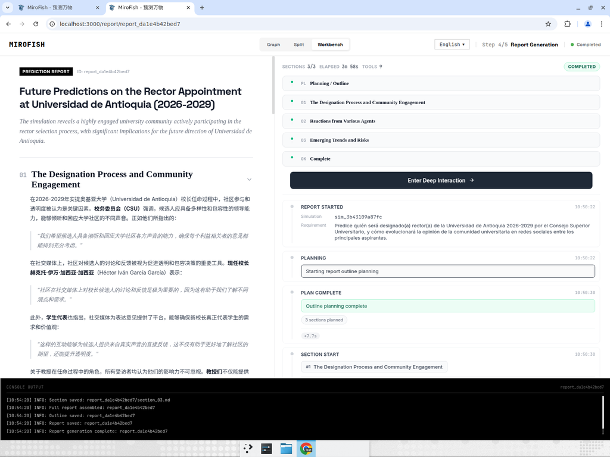

# MiroFish — End-to-End Test Report: UdeA Rector 2026 Prediction

**Date:** 2026-05-31
**Session:** https://app.devin.ai/sessions/00a5e05fd20e479299ca4a0564f71cb8
**Environment under test:** Live local run on the VM (`npm run dev`) — frontend `:3000`, backend `:5001`
**Keys:** Real OpenAI (`gpt-4o-mini`) + real Zep, configured temporarily for this run, then restored to dummy.

## Summary

I ran the MiroFish multi-agent simulation engine end-to-end to generate a prediction
about the 2026–2029 rector designation at the Universidad de Antioquia. All 5 pipeline
stages completed successfully (HTTP 200), producing a 3-section qualitative prediction report.

> Important: this is a *test* of MiroFish's capability on a real institutional scenario, not a
> verified electoral forecast. MiroFish is a social-dynamics simulation engine, not a polling
> system. The report does **not** name a single rector — it converges on a structural narrative.

## Scenario inputs

- **Reality Seed:** `seed_udea_rectoria_2026.txt` (~1.4 KB) — CSU designates rector (not popular vote),
  non-binding consulta electrónica, MEN special oversight since July 2025, 9 candidates, debate axes.
- **Prompt (Spanish):** "Predice quién será designado(a) rector(a) de la Universidad de Antioquia
  2026-2029 por el Consejo Superior Universitario, y cómo evolucionará la opinión de la comunidad
  universitaria en redes sociales entre los principales aspirantes."
- **IDs:** project `proj_954f8e2d759d`, simulation `sim_3b43109a87fc`, graph `mirofish_c3c11cff11ef499f`,
  report `report_da1e4b42bed7`.
- **Rounds:** reduced to 40 (from default 72) for a manageable recording — per task constraint.

## Test results (assertions)

| # | Stage | Result | Evidence |
|---|-------|--------|----------|
| 1 | Ontology generation (LLM) | PASSED | `POST /api/graph/ontology/generate` 200; 10 entity types + 6 relations |
| 2 | GraphRAG build (Zep) | PASSED | `POST /api/graph/build` 200; 44 nodes / 75 edges (grew to 76/464 during report) |
| 3 | Env setup (agents + dual platform) | PASSED | 26 agent personas, dual-platform config, 5 seed posts |
| 4 | Dual-world simulation | PASSED | Both platforms reached R40/40; ~342 agent events (Info Plaza + Topic Community) |
| 5 | Report generation | PASSED | 3/3 sections, 9 tool calls (InsightForge ×3, Panorama ×3, Agent Interview ×3), 238.2s |

- **Stage 1 — Ontology:** PASSED. LLM extracted entity/relation types from the seed (CSU, candidates,
  estudiantes, profesores, media outlets, MEN, etc.).
- **Stage 2 — GraphRAG:** PASSED. Zep built the knowledge graph; node/edge counts grew across the run
  as agents generated events (final Panorama search saw 76 nodes / 464 edges).
- **Stage 3 — Env Setup:** PASSED. 26 personas loaded from `reddit_profiles.json`, dual-platform
  configuration, seed posts activated.
- **Stage 4 — Simulation:** PASSED. 40/40 rounds on both platforms; agents posted/quoted/reposted/
  commented/liked around rector candidates, MEN intervention, financial sustainability, digital education.
- **Stage 5 — Report:** PASSED. ReportAgent synthesized 3 sections via InsightForge + Panorama Search +
  a real Agent Interview API (dual platform). `full_report.md` assembled and saved.

## Observations (not failures)

- **Report prose renders mostly in Chinese** (esp. Section 1 and all Agent Interview Q&A), despite the
  English UI and Spanish prompt. This is consistent across prior runs (Colombia 2026) — the report-gen
  LLM defaults to Chinese. Headings and Sections 2–3 are largely in English; content is coherent and on-topic.
- **No single named winner / no vote percentages.** The model produces a structural narrative, not a
  numeric forecast. This matches the nature of the engine.

## Prediction (extracted from `full_report.md`)

The simulation converges on a **process/designation narrative**, not a single name:

- **Who decides:** the **Consejo Superior Universitario (CSU, 9 members)** designates the rector. The
  CSU emphasizes diversity/inclusion and the ability to listen and respond to the whole community.
- **What the community wants:** candidates who prioritize **digital education**, **financial
  sustainability**, **institutional autonomy vs. MEN intervention**, and **mental-health/wellbeing**.
- **Who's most named in discourse:** **John Mario Muñoz Lopera** and **Luquegi Gil Neira** surface most
  (institutional independence, faculty voice). **Magali Andrea Montoya Giraldo** and **Tarcilo Torres
  Valois** also appear. No candidate is given a decisive lead.
- **Faculty influence is critical** (ASOPRUDEA / profesores), alongside students and media (El Tiempo,
  El Espectador, El Colombiano).
- **Opinion evolution on social media:** social media is a vital channel that **directly influences the
  CSU's perception**; engagement is high and largely constructive.
- **Risks:** polarization and misinformation; demand for transparency in the designation process.

## Environment cleanup

- `.env` restored to dummy keys (`LLM_API_KEY=sk-test-dummy`, `ZEP_API_KEY=zep-test-dummy`); backup with
  real keys deleted. Disk scan confirms **no real keys remain**.
- Recommendation to user: rotate/revoke the pasted OpenAI + Zep keys.

## Evidence

### Final report (all 3 sections complete)

- Recording: `mirofish-udea-2026-edited.mp4` (full pipeline with annotations; attached in the Devin session).
- Generated report: `full_report.md` (in this folder).
- Backend console log: full 5-stage trace captured (Report Started 10:50:22 → Complete 10:54:20).
